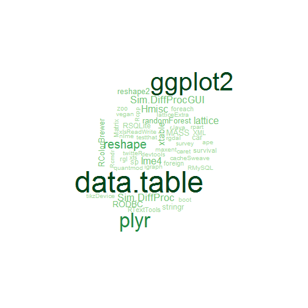
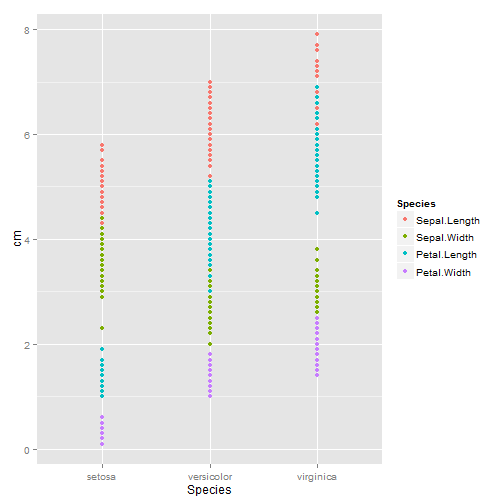

Most usable packages in real projects
========================================================

 


1. plyr, data.table, sqldf 패키지
1. reshape2 패키지
1. lubridate, stringr 패키지
1. ggplot2 패키지
1. knitr, markdown 패키지
1. caret
1. tm, KoNLP, tau 패키지


### [plyr]

* split-combind-apply
* R에서 가장 직관적이고 강력한 데이터 집계 라이브러리
* 멀티코어 프로세싱을 손쉽게 이용가능함 
* aggregate, tapply, by 류의 함수를 대체 가능한 함수 제공 

예)

![split_apply][img2]


```r
library(ggplot2)
library(plyr)

market_price <- read.csv("http://dl.dropbox.com/u/8686172/marketprice.csv", 
    fileEncoding = "UTF-8")


# ggplot(market_price, aes(x=A_NAME, y=A_PRICE, colour=M_TYPE_NAME)) +
# geom_boxplot(outlier.size=0) +
# stat_summary(aes(group=M_TYPE_NAME),fun.y='mean', geom='line', size=1,
# alpha=I(0.7))+ opts(axis.text.x=theme_text(angle=90))

ddply(market_price, .(A_NAME, M_TYPE_NAME), summarize, mean_price = mean(A_PRICE))
```

```
##                    A_NAME M_TYPE_NAME mean_price
## 1                  고등어    대형마트     1000.0
## 2       고등어(30cm,국산)    대형마트     5448.3
## 3       고등어(30cm,국산)    전통시장     3166.7
## 4       고등어(냉동,국산)    대형마트     3112.5
## 5       고등어(냉동,국산)    전통시장     3443.7
## 6     고등어(냉동,수입산)    대형마트     1500.0
## 7     고등어(냉동,수입산)    전통시장     1666.7
## 8       고등어(생물,국산)    대형마트     4597.3
## 9       고등어(생물,국산)    전통시장     3290.2
## 10    고등어(생물,수입산)    전통시장     1500.0
## 11  냉동참조기(20cm,국산)    대형마트      943.3
## 12                   달걀    대형마트     2464.9
## 13                   달걀    전통시장     2500.0
## 14             달걀(왕란)    대형마트     2613.2
## 15             달걀(왕란)    전통시장     2316.9
## 16             달걀(특란)    대형마트     2130.0
## 17             달걀(특란)    전통시장     2225.0
## 18                 닭고기    대형마트     6339.1
## 19                 닭고기    전통시장     5920.0
## 20           닭고기(육계)    대형마트     7980.6
## 21           닭고기(육계)    전통시장     5432.0
## 22           닭고기(중간)    대형마트     3480.0
## 23                   동태    대형마트      906.7
## 24                   동태    전통시장     5480.0
## 25       돼지고기(삼겹살)    대형마트    13595.0
## 26       돼지고기(삼겹살)    전통시장    12785.2
## 27     돼지고기(생삼겹살)    대형마트    14838.2
## 28     돼지고기(생삼겹살)    전통시장    11803.8
## 29                   명태    대형마트     1207.7
## 30                   명태    전통시장     1500.0
## 31        명태(45cm,국산)    대형마트        0.0
## 32      명태(45cm,수입산)    대형마트     2095.6
## 33      명태(45cm,수입산)    전통시장     2816.5
## 34      명태(냉동,수입산)    대형마트     2377.9
## 35      명태(냉동,수입산)    전통시장     3230.8
## 36      명태(러시아,냉동)    대형마트     2285.9
## 37      명태(러시아,냉동)    전통시장     2100.0
## 38      명태(생물,수입산)    대형마트      553.5
## 39      명태(생물,수입산)    전통시장     2555.6
## 40                     무    대형마트     1721.5
## 41                     무    전통시장     1462.1
## 42                무(1kg)    대형마트     1900.0
## 43                무(1kg)    전통시장     1532.9
## 44             무(세척무)    대형마트     2181.3
## 45             무(세척무)    전통시장     1444.4
## 46         무(세척무, 중)    대형마트     1828.3
## 47                     배    대형마트     4221.8
## 48                     배    전통시장     2888.9
## 49               배(신고)    대형마트     5185.8
## 50               배(신고)    전통시장     3795.5
## 51      배(신고),중급(대)    대형마트     3033.3
## 52         배(신고, 600g)    대형마트     4368.6
## 53         배(신고, 600g)    전통시장     3083.8
## 54               배(중품)    대형마트     3705.3
## 55               배(중품)    전통시장     2944.4
## 56          배(중품),신고    대형마트     2186.7
## 57          배(중품),신고    전통시장     2875.0
## 58                   배추    대형마트     2314.9
## 59                   배추    전통시장     2642.1
## 60          배추(2.5~3kg)    대형마트     2750.2
## 61          배추(2.5~3kg)    전통시장     2835.2
## 62             배추(국산)    대형마트     2836.7
## 63             배추(중간)    대형마트     2318.3
## 64             배추(중간)    전통시장     2203.4
## 65                   사과    대형마트     2659.5
## 66                   사과    전통시장     2792.9
## 67             사과(부사)    대형마트     2052.8
## 68             사과(부사)    전통시장     2575.4
## 69    사과(부사),중급(중)    대형마트     1650.0
## 70       사과(부사, 300g)    대형마트     3053.1
## 71       사과(부사, 300g)    전통시장     2530.7
## 72             사과(중품)    대형마트     2682.9
## 73             사과(중품)    전통시장     2541.7
## 74                 삼겹살    전통시장    12500.0
## 75                   상추    대형마트     1336.5
## 76                   상추    전통시장      803.5
## 77             상추(100g)    대형마트     1077.7
## 78             상추(100g)    전통시장      549.6
## 79                   생닭    전통시장     6000.0
## 80                 쇠고기    대형마트    21120.0
## 81           쇠고기(등심)    전통시장    11800.0
## 82    쇠고기(육우,불고기)    대형마트    25200.0
## 83    쇠고기(육우,불고기)    전통시장    17325.0
## 84    쇠고기(한우,불고기)    대형마트    20438.5
## 85    쇠고기(한우,불고기)    전통시장    17928.4
## 86      쇠고기(한우1등급)    대형마트    18190.6
## 87      쇠고기(한우1등급)    전통시장    17800.0
## 88      쇠고기(한우2등급)    대형마트    14320.0
## 89      쇠고기(한우2등급)    전통시장    14400.0
## 90                 애호박    대형마트      963.7
## 91                 애호박    전통시장      587.1
## 92                   양파    대형마트     3104.0
## 93                   양파    전통시장     2246.7
## 94          양파(1.5kg망)    대형마트     3286.3
## 95          양파(1.5kg망)    전통시장     2226.2
## 96           양파(작은망)    대형마트     3161.5
## 97           양파(작은망)    전통시장     2389.8
## 98                   오이    대형마트      449.8
## 99                   오이    전통시장      362.9
## 100          오이(다다기)    대형마트      483.7
## 101          오이(다다기)    전통시장      352.4
## 102                오징어    대형마트     2020.0
## 103                오징어    전통시장     1660.0
## 104          오징어(냉동)    대형마트     1730.0
## 105          오징어(냉동)    전통시장     1583.3
## 106     오징어(냉동,국산)    대형마트     1930.2
## 107     오징어(냉동,국산)    전통시장     2340.5
## 108   오징어(냉동,수입산)    대형마트     1786.7
## 109     오징어(생물,국산)    대형마트     2332.8
## 110     오징어(생물,국산)    전통시장     2145.7
## 111   오징어(생물,수입산)    대형마트     1680.0
## 112                  조기    대형마트     7250.0
## 113                  조기    전통시장     2842.9
## 114       조기(국산,냉동)    대형마트     4342.4
## 115       조기(국산,냉동)    전통시장     1546.6
## 116       조기(국산,생물)    대형마트     3677.9
## 117       조기(국산,생물)    전통시장     2379.3
## 118       조기(냉동,국산)    대형마트     2077.4
## 119       조기(냉동,국산)    전통시장     1775.8
## 120     조기(냉동,수입산)    대형마트     4537.5
## 121     조기(냉동,수입산)    전통시장     3429.3
## 122       조기(생물,국산)    대형마트     4226.0
## 123       조기(생물,국산)    전통시장     1663.5
## 124     조기(생물,수입산)    대형마트     2980.0
## 125     조기(중국산,생물)    전통시장     4333.3
## 126                  호박    대형마트      694.4
## 127                  호박    전통시장      534.9
## 128      호박(인큐베이터)    대형마트      821.1
## 129      호박(인큐베이터)    전통시장      779.1
```


* plyr의 멀티코어 처리는 윈도우에서는 잘 동작하지 않음
* 하지만 plyr를 사용하지 않은 멀티코어처리는 잘 동작함 
* foreach 패키지에 종속된 기능이며, 기본 배포판에 속한 parallel 패키지를 이용하고자 한다면 doParallel패키지를 사용해야 된다. 
* 리눅스에서는 굉장히 쾌적하게 돌아간다(600만건 처리시...). 


```r
# 멀티코어사용


system.time({
    a1 <- ddply(market_price, .(A_NAME, M_TYPE_NAME), summarize, mean_price = mean(A_PRICE))
})


# for Linux on my case
library(doMC)
registerDoMC()

system.time({
    a3 <- ddply(market_price, .(A_NAME, M_TYPE_NAME), summarize, mean_price = mean(A_PRICE), 
        .parallel = TRUE)
})

```


#### [data.table]


```r
library(data.table)

market_price.dt <- data.table(market_price)  #--- (1)

market_price.dt[2, list(M_NAME)]  #--- (2)
```

```
##          M_NAME
## 1: 대림중앙시장
```

```r

market_price[2, "M_NAME", drop = F]
```

```
##         M_NAME
## 2 대림중앙시장
```

```r

market_price.dt[, list(avg = mean(A_PRICE)), by = list(M_TYPE_NAME, A_NAME)]
```

```
##      M_TYPE_NAME              A_NAME  avg
##   1:    전통시장          사과(부사) 2575
##   2:    전통시장            배(신고) 3796
##   3:    전통시장          배추(중간) 2203
##   4:    전통시장          무(세척무) 1444
##   5:    전통시장        양파(작은망) 2390
##  ---                                     
## 125:    전통시장              오징어 1660
## 126:    대형마트 고등어(냉동,수입산) 1500
## 127:    대형마트              고등어 1000
## 128:    전통시장 고등어(생물,수입산) 1500
## 129:    대형마트 오징어(생물,수입산) 1680
```

```r


setkey(market_price.dt, A_NAME)
market_price.dt["고등어"]
```

```
##    A_NAME  P_SEQ M_SEQ          M_NAME A_SEQ      A_UNIT A_PRICE
## 1: 고등어 301107    22 이마트 여의도점    13 1마리(30cm)    1000
##    P_YEAR_MONTH ADD_COL M_TYPE_CODE M_TYPE_NAME M_GU_CODE M_GU_NAME
## 1:       May-12  작은것           2    대형마트    560000  영등포구
```

```r
head(market_price.dt)
```

```
##     P_SEQ M_SEQ            M_NAME A_SEQ            A_NAME       A_UNIT
## 1: 301107    22   이마트 여의도점    13            고등어  1마리(30cm)
## 2: 316758    14      장위골목시장   316 고등어(30cm,국산) 1마리 (30cm)
## 3: 317556    56        롯데백화점   316 고등어(30cm,국산)        1마리
## 4: 317700    72          금남시장   316 고등어(30cm,국산)        1마리
## 5: 317748    74   이마트 왕십리점   316 고등어(30cm,국산)  1마리(30cm)
## 6: 318452    16 현대백화점 미아점   316 고등어(30cm,국산)        1마리
##    A_PRICE P_YEAR_MONTH         ADD_COL M_TYPE_CODE M_TYPE_NAME M_GU_CODE
## 1:    1000       May-12          작은것           2    대형마트    560000
## 2:    2500       Jul-12                           1    전통시장    290000
## 3:    7000       Jul-12 국내산제주)행사           2    대형마트    140000
## 4:    6000       Jul-12                           1    전통시장    200000
## 5:    2980       Jul-12                           2    대형마트    200000
## 6:    5000       Jul-12            냉동           2    대형마트    290000
##    M_GU_NAME
## 1:  영등포구
## 2:    성북구
## 3:      중구
## 4:    성동구
## 5:    성동구
## 6:    성북구
```

```r
setkey(market_price.dt)


market_price.dt[A_NAME == "고등어", ]
```

```
##     P_SEQ M_SEQ          M_NAME A_SEQ A_NAME      A_UNIT A_PRICE
## 1: 301107    22 이마트 여의도점    13 고등어 1마리(30cm)    1000
##    P_YEAR_MONTH ADD_COL M_TYPE_CODE M_TYPE_NAME M_GU_CODE M_GU_NAME
## 1:       May-12  작은것           2    대형마트    560000  영등포구
```

```r
# market_price.dt['고등어']
head(market_price.dt)
```

```
##     P_SEQ M_SEQ       M_NAME A_SEQ           A_NAME     A_UNIT A_PRICE
## 1: 299094   145 마천중앙시장   305 사과(부사, 300g)        1개    1995
## 2: 299095   145 마천중앙시장   306   배(신고, 600g)        1개    3266
## 3: 299096   145 마천중앙시장   307    배추(2.5~3kg)      1포기    2650
## 4: 299097   145 마천중앙시장    25               무   1개(1kg)     730
## 5: 299098   145 마천중앙시장   309    양파(1.5kg망) 1망(1.5kg)    2380
## 6: 299099   145 마천중앙시장   310       상추(100g)        1봉     980
##    P_YEAR_MONTH    ADD_COL M_TYPE_CODE M_TYPE_NAME M_GU_CODE M_GU_NAME
## 1:       May-12 4개 7980원           1    전통시장    710000    송파구
## 2:       May-12 3개 9800원           1    전통시장    710000    송파구
## 3:       May-12                      1    전통시장    710000    송파구
## 4:       May-12                      1    전통시장    710000    송파구
## 5:       May-12    햇양파            1    전통시장    710000    송파구
## 6:       May-12       150g           1    전통시장    710000    송파구
```

```r

```


### [sqldf]

* 데이터 테이블을 조작하는데 SQL을 사용하게 해주는 패키지 
* DB에 익숙한 사용자에게 강력한 패키지 


```r
library(sqldf)
sqldf("SELECT * FROM market_price LIMIT 5;")
```

```
##    P_SEQ M_SEQ       M_NAME A_SEQ       A_NAME A_UNIT A_PRICE P_YEAR_MONTH
## 1 316440    19 대림중앙시장    50   사과(부사)    1개    1660       Jul-12
## 2 316441    19 대림중앙시장   276     배(신고)    1개    2000       Jul-12
## 3 316442    19 대림중앙시장   271   배추(중간)  1포기    1666       Jul-12
## 4 316443    19 대림중앙시장   282   무(세척무)    1개    1000       Jul-12
## 5 316444    19 대림중앙시장   272 양파(작은망)    1망    2500       Jul-12
##      ADD_COL M_TYPE_CODE M_TYPE_NAME M_GU_CODE M_GU_NAME
## 1    6/10000           1    전통시장    560000  영등포구
## 2                      1    전통시장    560000  영등포구
## 3 3포기 5000           1    전통시장    560000  영등포구
## 4                      1    전통시장    560000  영등포구
## 5     햇양파           1    전통시장    560000  영등포구
```

```r

market_price_group_by <- sqldf("SELECT M_TYPE_NAME, A_NAME, avg(A_PRICE) as mean_price FROM market_price GROUP BY M_TYPE_NAME, A_NAME")

```


### [reshape2]

* 집계 보다는 데이터의 형태를 바꾸는 작업을 수행 
* ggplot2, plyr의 개발자가 개발, 데이터 철학 공유하고 있음 
* Tidy Data
  * 각 변수는 개별의 열(column)으로 존재한다.
  * 각 관측치는 행(row)를 구성한다.
  * 각 테이블은 단 하나의 관측기준에 의해서 조직된 데이터를 저장한다.
* Raw Data -> Tidy Data로의 장점 
  * Tidy Data에서 다양한 데이터 형태로 변형이 최소의 노력으로 가능해지며 특히 R에서 이런 장점이 두드러 진다. 


```r

library(reshape2)

head(iris)
```

```
##   Sepal.Length Sepal.Width Petal.Length Petal.Width Species
## 1          5.1         3.5          1.4         0.2  setosa
## 2          4.9         3.0          1.4         0.2  setosa
## 3          4.7         3.2          1.3         0.2  setosa
## 4          4.6         3.1          1.5         0.2  setosa
## 5          5.0         3.6          1.4         0.2  setosa
## 6          5.4         3.9          1.7         0.4  setosa
```

```r

iris.melt <- melt(iris, id = "Species", value.name = "cm")

head(iris.melt)
```

```
##   Species     variable  cm
## 1  setosa Sepal.Length 5.1
## 2  setosa Sepal.Length 4.9
## 3  setosa Sepal.Length 4.7
## 4  setosa Sepal.Length 4.6
## 5  setosa Sepal.Length 5.0
## 6  setosa Sepal.Length 5.4
```

```r

ggplot(iris.melt, aes(Species, cm)) + geom_point(aes(colour = variable)) + scale_color_discrete("Species")
```

 


```r
load("pew.RData")
head(raw)
```

```
##             religion <$10k $10-20k $20-30k $30-40k $40-50k $50-75k
## 1           Agnostic    27      34      60      81      76     137
## 2            Atheist    12      27      37      52      35      70
## 3           Buddhist    27      21      30      34      33      58
## 4           Catholic   418     617     732     670     638    1116
## 5 Don't know/refused    15      14      15      11      10      35
## 6   Evangelical Prot   575     869    1064     982     881    1486
##   $75-100k $100-150k >150k Don't know/refused
## 1      122       109    84                 96
## 2       73        59    74                 76
## 3       62        39    53                 54
## 4      949       792   633               1489
## 5       21        17    18                116
## 6      949       723   414               1529
```

```r
paw <- raw[, -c(8, 9, 10, 11)]
melted <- melt(paw, measure.vars = c(2, 3, 4, 5, 6, 7), variable.name = "income", 
    value.name = "freq")

head(melted)
```

```
##             religion income freq
## 1           Agnostic  <$10k   27
## 2            Atheist  <$10k   12
## 3           Buddhist  <$10k   27
## 4           Catholic  <$10k  418
## 5 Don't know/refused  <$10k   15
## 6   Evangelical Prot  <$10k  575
```

```r
tail(melted)
```

```
##                  religion  income freq
## 103                Muslim $50-75k   23
## 104              Orthodox $50-75k   47
## 105       Other Christian $50-75k   14
## 106          Other Faiths $50-75k   63
## 107 Other World Religions $50-75k    7
## 108          Unaffiliated $50-75k  528
```

```r

library(ggplot2)
ggplot(melted, aes(religion, freq)) + geom_bar(aes(fill = income), stat = "identity") + 
    theme(axis.text.x = element_text(angle = 45))
```

 

```r

melted <- ddply(melted, .(religion), mutate, freq_sum = sum(freq))

melted <- ddply(melted, .(religion, income), summarise, freq_precent = freq/freq_sum)
head(melted)
```

```
##   religion  income freq_precent
## 1 Agnostic   <$10k      0.06506
## 2 Agnostic $10-20k      0.08193
## 3 Agnostic $20-30k      0.14458
## 4 Agnostic $30-40k      0.19518
## 5 Agnostic $40-50k      0.18313
## 6 Agnostic $50-75k      0.33012
```

```r

ggplot(melted, aes(religion, freq_precent)) + geom_bar(aes(fill = income), stat = "identity") + 
    theme(axis.text.x = element_text(angle = 45))
```

 


### [lubridate], [stringr]

* lubridate
  * 실무에서 쓰는 다양한 숫자 스트링 포맷에 대한 간편한 변환 제공 
  * 시간과 날짜에 대한 다양한 연산 제공 
  * 한글 윈도우 문제...
* stringr
  * 문자열 편집에 쓰일 수 있는 다향한 텍스트 핸등링 함수 제공 


```r
library(lubridate)

as.POSIXct("2012-12-12")
as.POSIXct("20121212", format = "%Y%m%d")

Sys.getlocale("LC_TIME")
# [1] 'Korean_Korea.949'

ymd("2013-01-03")
# 다음에 오류gsub('+', '*', fixed = T, gsub('>', '_e>', num)) :
# '<ec><98><a4>?<84>|<ec>삤<ed>썑)(?![[:alpha:]]))|((?<h_f_e>2[0-4]|[01]?\d)\D+(?<m_f_e>[0-5]?\d)\D+((?<os_f_s_e>[0-5]?\d\.\d+)|(?<s_f_e>[0-6]?\d))))'에
# 잘못된 멀티 바이트 문자가 있습니다

Sys.setlocale("LC_TIME", "C")
# [1] 'C'
ymd("2013-01-03")
# 1 parsed with %Y-%m-%d [1] '2013-01-03 UTC'


Sys.setlocale("LC_TIME", "Korean_Korea.949")
format(Sys.time(), "%a %b %d %X %Y %Z")
# [1] '목 1 03 오후 2:26:21 2013 KST'

Sys.setlocale("LC_TIME", "C")
format(Sys.time(), "%a %b %d %X %Y %Z")
# [1] 'Thu Jan 03 14:26:34 2013 KST'
```


```r
library(lubridate)
```

```
## Attaching package: 'lubridate'
```

```
## The following object is masked from 'package:chron':
## 
## days, hours, minutes, seconds, years
```

```
## The following object is masked from 'package:data.table':
## 
## hour, mday, month, quarter, wday, week, yday, year
```

```
## The following object is masked from 'package:plyr':
## 
## here
```

```r

x <- c(20090101, "2009-01-02", "2009 01 03", "2009-1-4", "2009-1, 5", "Created on 2009 1 6", 
    "200901 !!! 07")
y <- ymd(x)


y
```

```
## [1] "2009-01-01 UTC" "2009-01-02 UTC" "2009-01-03 UTC" "2009-01-04 UTC"
## [5] "2009-01-05 UTC" "2009-01-06 UTC" "2009-01-07 UTC"
```

```r

y + days(1) + hours(6) + minutes(30)
```

```
## [1] "2009-01-02 06:30:00 UTC" "2009-01-03 06:30:00 UTC"
## [3] "2009-01-04 06:30:00 UTC" "2009-01-05 06:30:00 UTC"
## [5] "2009-01-06 06:30:00 UTC" "2009-01-07 06:30:00 UTC"
## [7] "2009-01-08 06:30:00 UTC"
```

```r

y - months(12)
```

```
## [1] "2008-01-01 UTC" "2008-01-02 UTC" "2008-01-03 UTC" "2008-01-04 UTC"
## [5] "2008-01-05 UTC" "2008-01-06 UTC" "2008-01-07 UTC"
```


```r
library(stringr)

fruits <- c("apples and oranges and pears and bananas", "pineapples and mangos and guavas")
str_split(fruits, " and ")
```

```
## [[1]]
## [1] "apples"  "oranges" "pears"   "bananas"
## 
## [[2]]
## [1] "pineapples" "mangos"     "guavas"
```

```r
str_trim("  String with trailing and leading white space\t")
```

```
## [1] "String with trailing and leading white space"
```


### [ggplot2]

* Grammar of Graphics의 구현체 
* "기본 그래픽 시스템은 그림을 그리기 위해 좋은 툴이지만, ggplot2는 데이터를 이해하는 데 좋은 시각화 툴이다." --  _Hadley Wickham_ --
* [참고](http://freesearch.pe.kr/archives/3134)


```r
library(ggplot2)

# 서로 다른 표현
qplot(carat, price, data = diamonds, geom = "point", colour = clarity)  # (1)
```

 

```r
ggplot(data = diamonds, aes(x = carat, y = price)) + geom_point(aes(colour = clarity))  # (2)
```

 

```r

# 매핑 정보 및 각종 정보들을 보여줌
s <- ggplot(data = diamonds, aes(x = carat, y = price))
summary(s)
```

```
## data: carat, cut, color, clarity, depth, table, price, x, y, z
##   [53940x10]
## mapping:  x = carat, y = price
## faceting: facet_null()
```

```r

# 미적 요소 매핑의 오버라이딩
ggplot(data = diamonds, aes(x = carat, y = price)) + geom_point(aes(colour = clarity)) + 
    geom_smooth()  #  (1)
```

 

```r

ggplot(data = diamonds, aes(x = carat, y = price, colour = clarity)) + geom_point() + 
    geom_smooth()  #  (2)
```

 

```r

# set기능으로 색상 적용
# http://research.stowers-institute.org/efg/R/Color/Chart/
ggplot(data = diamonds, aes(x = carat, y = price, colour = clarity)) + geom_point(colour = "darkblue")
```

 

```r

# group 매핑
p <- ggplot(data = diamonds, aes(x = carat, y = price))
p + geom_smooth()  #  (1)
```

 

```r
p + geom_smooth(aes(group = clarity))  #  (2)
```

 

```r

# geom과 stat 객체
ggplot(data = diamonds, aes(x = price)) + geom_bar()  #  (1)
```

 

```r
ggplot(data = diamonds, aes(x = price)) + geom_bar(aes(y = ..count..))  #  (2)
```

 

```r
ggplot(data = diamonds, aes(x = price)) + geom_bar(aes(y = ..density..))
```

 

```r
ggplot(data = diamonds, aes(x = price)) + geom_bar(aes(y = ..ncount..))
```

 

```r
ggplot(data = diamonds, aes(x = price)) + geom_bar(aes(y = ..ndensity..))
```

 

```r
ggplot(data = diamonds, aes(x = price)) + geom_bar(aes(y = ..density..)) + ylab("밀도")
```

 

```r


# 위치 조정

ggplot(data = diamonds, aes(x = price)) + geom_bar(aes(fill = cut), binwidth = 3000)
```

 

```r
ggplot(data = diamonds, aes(x = price)) + geom_bar(aes(fill = cut), binwidth = 3000, 
    position = "dodge")
```

 

```r
ggplot(data = diamonds, aes(x = price)) + geom_bar(aes(fill = cut), binwidth = 3000, 
    position = "fill")
```

 

```r

# facet
ggplot(data = diamonds, aes(x = price)) + geom_bar(binwidth = 3000) + facet_grid(. ~ 
    cut)
```

 

```r
ggplot(data = diamonds, aes(x = price)) + geom_bar(binwidth = 3000) + facet_wrap(~cut, 
    nrow = 3)
```

 

```r

# geom과 stat의 결합
d <- ggplot(diamonds, aes(price))
d + stat_bin(geom = "bar")
```

 

```r
d + stat_bin(geom = "area")
```

 

```r
d + stat_bin(aes(size = ..ndensity..), geom = "point")
```

 

```r
d + stat_bin(aes(y = 1, fill = ..density..), geom = "tile")
```

 

```r


# 레이블 및 텍스트
ggplot(data = diamonds, aes(x = price)) + geom_bar(aes(fill = cut), binwidth = 3000, 
    position = "fill") + xlab("가격") + ylab("빈도") + scale_fill_discrete("커팅") + 
    theme(axis.text.x = element_text(angle = 90, vjust = 0.4))
```

 


* [더 많은 예제](http://docs.ggplot2.org/current/)


### [knitr], [markdown]

* [knitr]는 인코딩 문제로 그동안 윈도우에서 쓰기 힘들었으나 최신 버전에서 옵션 제공 
  * 문서내의 R 코드를 실행 후 이를 문서에 첨부해줌 
  * 문서내의 R 코드에 대해서 미적 옵션을 다양하게 제공함 
* [markdown]은 markdown 문서를 주로 xhtml형태로 변환해줌
  * RStudio에서 잘 지원하고 있음 
  * 실무 분석 draft 문서는 Rmd파일로 작성 하고 분석 내용 공유 용이  


```r
library(knitr)

knit("bicdata.Rmd", encoding = "UTF-8")

purl("bicdata.Rmd", encoding = "UTF-8")
system("pandoc -o bicdata.docx bicdata.md")

```


#### 윈도우 작업시 주의사항 
* 문서는 반드시 UTF-8 인코딩으로 작성한다.
* knit, purl명령어 사용시 반드시 `encoding="UTF-8"`을 명시한다.


### 마지막 예제 

* knitr로 하는 Latex 


[protemp]:http://projecttemplate.net/mastering.html 
[ggplot2]:http://ggplot2.org/
[plyr]:http://cran.r-project.org/web/packages/plyr/index.html
[data.table]:http://datatable.r-forge.r-project.org/
[reshape2]:http://cran.r-project.org/web/packages/reshape2/index.html
[lubridate]:http://cran.r-project.org/web/packages/lubridate/index.html
[knitr]:http://yihui.name/knitr/
[markdown]:http://cran.r-project.org/web/packages/markdown/index.html
[stringr]:http://cran.r-project.org/web/packages/stringr/index.html

[sqldf]:http://code.google.com/p/sqldf/

[img1]: packages.png
[img2]: splitapply.png
