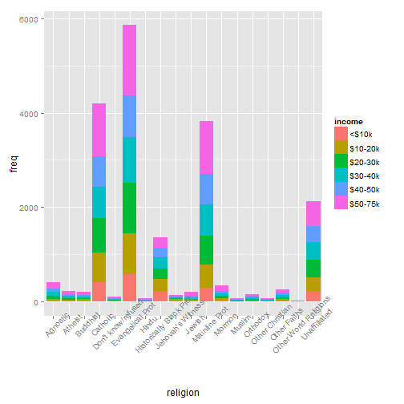
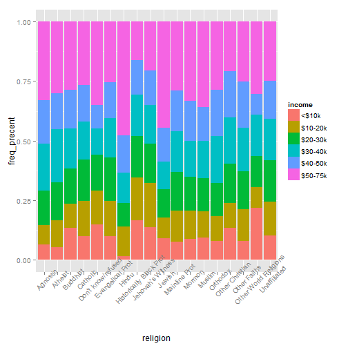

전처리 
========================================================


```r
library(caret)
set.seed(3456)
trainIndex <- createDataPartition(iris$Species, p = 0.8, list = FALSE, times = 1)
head(trainIndex)
```

```
##      Resample1
## [1,]         1
## [2,]         2
## [3,]         4
## [4,]         5
## [5,]         6
## [6,]         8
```

```r

irisTrain <- iris[trainIndex, ]
irisTest <- iris[-trainIndex, ]

plot(iris[, -5])
```

 

```r

bxcx <- BoxCoxTrans(irisTrain$Petal.Length, fudge = 0.004)

hist(predict(bxcx, irisTrain$Petal.Length))
```

 

```r

mdl <- preProcess(irisTrain[, -5], method = c("BoxCox", "center", "scale", "pca"))

transformed <- predict(mdl, irisTrain[, -5])

head(transformed)
```

```
##      PC1     PC2
## 1 -2.329 -0.4258
## 2 -2.168  0.6913
## 4 -2.431  0.6534
## 5 -2.457 -0.5533
## 6 -2.027 -1.3134
## 8 -2.311 -0.1838
```

```r

plot(transformed)
```

 

```r

nearZeroVar(irisTrain)
```

```
## integer(0)
```

```r


correlations <- cor(irisTrain[, -5])

library(corrplot)
corrplot(correlations, order = "hclust")
```

 

```r

highCorr <- findCorrelation(correlations, cutoff = 0.75)

correlations[, highCorr]
```

```
##              Petal.Length Petal.Width
## Sepal.Length       0.8667      0.8047
## Sepal.Width       -0.4460     -0.4013
## Petal.Length       1.0000      0.9607
## Petal.Width        0.9607      1.0000
```


